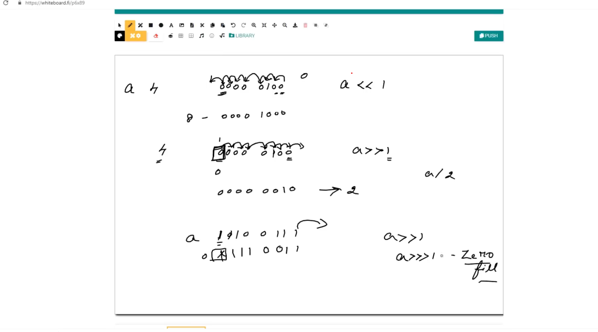
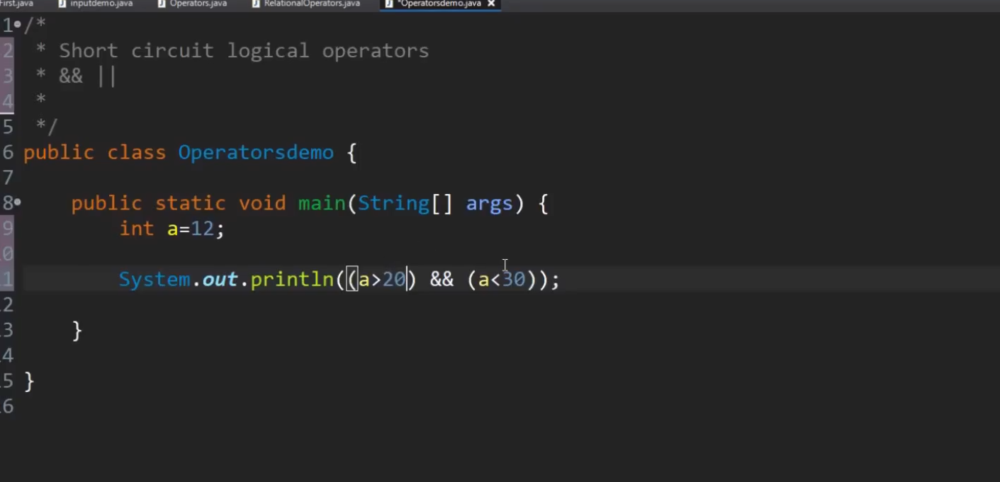
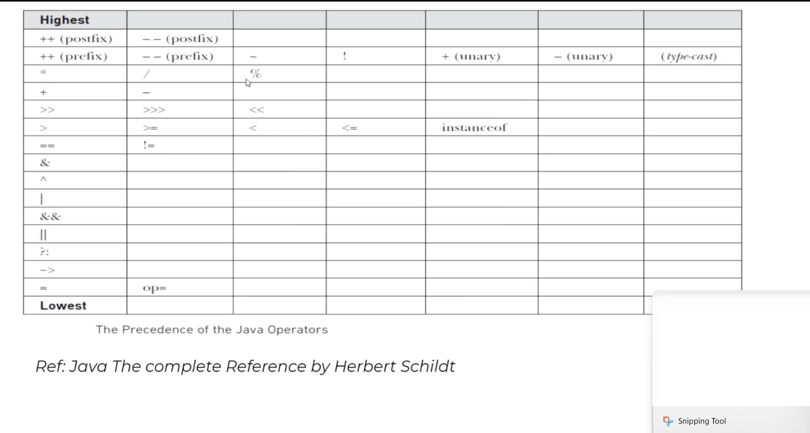
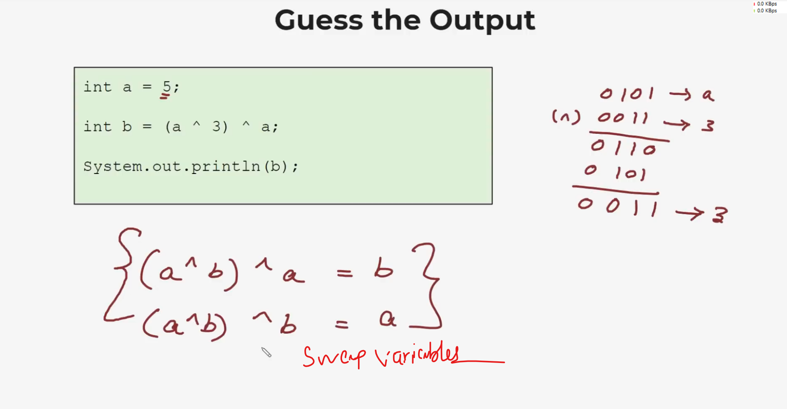

### Method

* A method is a block of code which only runs when it is called.
* You can pass data, known as parameters, into a method.
* Methods are used to perform certain actions, and they are also known as functions.
* Why use methods? To reuse code: define the code once, and use it many times.

A method must be declared within a class. It is defined with the name of the method, followed by parentheses (). Java provides some pre-defined methods, such as System.out.println(), but you can also create your own methods to perform certain actions:

    public class Main {
        static void myMethod() {
        // code to be executed
        }
    }

* myMethod() is the name of the method
* static means that the method belongs to the Main class and not an object of the Main class. You will learn more about objects and how to access methods through objects later in this tutorial.
* void means that this method does not have a return value. You will learn more about return values later in this chapter
* 
### Java recursion
Recursion is the technique of making a function call itself. This technique provides a way to break complicated problems down into simple problems which are easier to solve.
Ex: Adding sum of 10
https://www.w3schools.com/java/java_recursion.asp

    int result = sum(10);
    System.out.println(result);
    }

    public static int sum(int k){
        if (k> 0){
            return k + sum(k-1);
        }
        else{
            return 0;
        }

Example Explained
When the sum() function is called, it adds parameter k to the sum of all numbers smaller than k and returns the result. When k becomes 0, the function just returns 0. When running, the program follows these steps:

        10 + sum(9)
        10 + ( 9 + sum(8) )
        10 + ( 9 + ( 8 + sum(7) ) )
        ...
        10 + 9 + 8 + 7 + 6 + 5 + 4 + 3 + 2 + 1 + sum(0)
        10 + 9 + 8 + 7 + 6 + 5 + 4 + 3 + 2 + 1 + 0
Since the function does not call itself when k is 0, the program stops there and returns the result.

#### Halting condition
    public static void main(String[] args) {
        int result = sum(5,10);
        System.out.println(result);
    }

    public static int sum(int start, int end){
        if (end > start){
            return end + sum(start, end-1);
        }
        else{
            return end;
        }
    }

### Scanner 
    System.in -- Input Stream da class to get input.
        // Class Object = new Class();
        Scanner sc = new Scanner(System.in);

        System.out.print("What is your name: ");
        String name = sc.nextLine();

        System.out.print("What is your age: ");
        int age = sc.nextInt();
        sc.nextLine();
        // No kodutu next String edukanum enda nextLine() podanum. ilana antha enter aa nextLine aa eduthudum.

        System.out.print("What is your profession: ");
        String profession = sc.nextLine();

        System.out.println(String.format("%s %d %s", name,age,profession));

```
Scanner sc = new Scanner(System.in);
System.out.print("Enter number1: ");
double num1 = sc.nextDouble();
System.out.print("Enter number2: ");
double num2 = sc.nextDouble();
double total = num1 + num2;
System.out.println("Total is " + total);

```
Pyramid using just Scanner and print

        Scanner sc = new Scanner(System.in);

        System.out.print("Enter: ");
        String num = sc.next();
        System.out.println("     " + num);
        System.out.println("   " + num + " " + num+ " " + num);
        System.out.println(" " + num + " " + num+ " " + num+ " " + num+ " " + num);
        System.out.println(num + " " + num+ " " + num+ " " + num+ " " + num+ " " + num);

### If else 
```
int num = 10;
if (num == 10){
System.out.println("Your number is 10");
return;
}
if (num > 10){
System.out.println("Greater than 10");
} else {
System.out.println("Less than 10");
}

// == check references that are same or not
// /eqauls. check contents

```

### Logical Operator

&& - And 

|| - Or

! - Not

```
        int age = 25;
        boolean votingRegistered = true;

        if (age>= 18){
            if (votingRegistered){
                System.out.println("Eligible to vote");
            } else {
                System.out.println("You are not eligible to vote");
            }
        } else {
            System.out.println("You are not eligible to vote");
        }
            
          -----------After refactoring----
          
         if (age>= 18 && votingRegistered){
            System.out.println("Eligible to vote");
        } else {
            System.out.println("You are not eligible to vote");
        }  
```

### Switch case
    

        int a =1;
        
        // Using if else
        if (a == 1) {
            System.out.println("One");
        } else if(a == 2) {
            System.out.println("Two");
        }else{
            System.out.println("Other numbers.");
        }

        // Using switch
        switch (a){
            case 1:
                System.out.println("One");
                break;
            case 2:
                System.out.println("Two");
                break;
            default:
                System.out.println("Other numbers.");

                // If one case matches, it will not check other cases and will print automatically, where we use break.
        }

### Variable 
    
    Format:
        DataType variableName;

        int ticketPrice; // variable declaration
        ticketPrice = 800;  // assigning value
            
        int price = 50; // initialization

    boolean soldOut = false;
    char ch = "0";
    double d = 2.7;
    long x = 7l; // use L at the end
    System.out.println("\"Hello World\" "); // Escape Sequence  

    int a = 010; // Octal Num
    int b = 0xA; // Hexadecimal Num
    int c = 0b11011; // Binary  // JDK 7.0
    int n2 = 123_456_7890; // better readabilty, will avoid _ and store it in mem.
    float pi = 3.14591;
    float pi = 314591e-5; // scientific notation. both are same


### Type Casting

    byte b = 1; // 1bytes
    int i; // 4 bytes
    i = b; // sinna byte la varatha perisula(range) sekkalam. but perisa ikiratha sinathula poda aela.

    Ex:
        byte b1;
        int z = 10;
        c = z; // Type mismatch error
        Apdiyum store pannanum enda,

        c = (byte)z; // explicit type conversion
        // z a byte aa mathi save pannum. but out of range na sikkalakum.

### Operators
     /*  Arithmetic operator */
        // RHS la irukuratha than muthal pakkum. pathu atha LHS ki assign pannum.

        // Operator + - / *    % -> reminder
        int a=10, b=5, c;
        c = a + b;  // a, b -> operands , + -> operator

        /*  Compound operator */
        a = a + 3;
        a += 3;

        /*  Increment / Decrement */
        a = a + 1;
        a++; // post increment
        ++a; // pre increment

        --a;
        a--;

        c = a++;
        System.out.println("a is " + a);
        System.out.println("c is " + c);
        // here c ku a save pannitu than increment. thats the use of post increment. Maari kodutha 12 varum both.

iNCREMENT/ DEC Exercise.

        int a=3, b=4, c;    
        c = a + b + a++ + b++ + ++a + ++b;
        // 3 4 3 4 5 6
        System.out.println(c); 

Relational Operator
    
        > >= < <= =!
        XOR ku 1,0 vantha 1 // same vantha 0

        ^ XOR
        & AND
        | OR
        ~ NOT

### BIT WISE Shift 
        <<  Left shift
        >>  Right shift
        >>> Left shift zero fill

    
        2>>1 - Right shift, like divide by 2.
        0000 0100 - 4
        0000 0010 - 2

        Athe sign enda (4 means + ) athe sign replace aakum 0.   
        when the new number come, if we need that as zero in left, PUT 3 >>>.
        2>>>1.  (Zero fill)

        -5 enda athu 2s complement aa tan save aakum.        

        2<<1 - Left shift, like 2^2.
        0000 1000 - 8
        0001 0000 - 16
        



### Short circuit logical Op

        &&   ||
        
         int a = 12;
        //                  false           --> return false, next condition pakathu. Normal & enda rendum pathu than output varum.
        System.out.println( a>20 && a<30);



### Priority list Precedence


#### XOR

Getting the same input value. can use to swap variables as well.



        // Whatever we put get as the result
       int a = 5;
       int b = (a ^ 4) ^ a;
        System.out.println(b); // 4

        int a =  5, b = 3;
        a = a ^ b;
        b = a ^ b;
        System.out.println(b);
        a = a ^ b;
        System.out.println(a);

Grade Exercise

         int mark;
        Scanner sc = new Scanner(System.in);
        System.out.print("Enter your marks (0-100): ");
        mark = sc.nextInt();

        if (mark > 90)
            System.out.println("Grade A");
        else if (mark > 80)
            System.out.println("Grade B");
        else if (mark > 70)
            System.out.println("Grade C");
        else if (mark > 60)
            System.out.println("Grade D");
        else
            System.out.println("Grade E");

### Conditional Operator
        int a=45, b=60;
        int max;

        max = (a>b) ? a : b;

    //        if (a>b)
    //            max = a;
    //        else
    //            max = b;

### Access Arrays
        String[] arr = {"a", "b", "c", "d", "e"};

        // accessing array
        // M1 - loop through an array
        for (int i = 0; i < arr.length; i++)
            System.out.println(arr[i]);

        // M2 - for each
        for (String i: arr){
            System.out.println(i);
        }


# OOP Notes
### Encapsulation

// Person.Java

    public class Person{
    private String name;

    // Getter
    public String getName(){
        return name;
    }

    // Setter
    public void setName(String newName){
        this.name = newName;
        }
    }

// Main.java

    public class Main {
        public static void main(String[] args) {
            Person person = new Person();
            person.setName("jhon");
            System.out.println(person.getName());
        }
    }

When u declare variable as private, if you have to assign value or get that value,
you have to use getter and setter inorder to do that. otherwise cannot access unless same class (Main, Person - 2 sep Java class).
Cannot access private variable from outside of the class.

### Abstraction

Abstract Classes and Methods
Data abstraction is the process of hiding certain details and showing only essential information to the user.
Abstraction **can be achieved with either abstract classes or interfaces** 

The abstract keyword is a **non-access modifier, used for classes and methods**:

**Abstract class:** is a restricted class that cannot be used to create objects (to access it, it must be inherited from another class).

**Abstract method:** can only be used in an abstract class, and it does not have a body. The body is provided by the subclass (inherited from).

An abstract class can have both abstract and regular methods:

    abstract class Animal {
        public abstract void animalSound();
            public void sleep() {
                System.out.println("Zzz");
            }
    }


From the example above, it is not possible to create an object of the Animal class:

    Animal myObj = new Animal(); // will generate an error

To access the abstract class, it must be inherited from another class. Let's convert the Animal class we used in the 
Polymorphism chapter to an abstract class:

    // Abstract class

    abstract class Animal {
        // Abstract method (does not have a body)
        public abstract void animalSound();
        // Regular method
        public void sleep() {
            System.out.println("Zzz");
        }
    }
    
    // Subclass (inherit from Animal)
    class Pig extends Animal {
        public void animalSound() {
            // The body of animalSound() is provided here
            System.out.println("The pig says: wee wee");
        }
    }
    
    class Main {
        public static void main(String[] args) {
            Pig myPig = new Pig(); // Create a Pig object
            myPig.animalSound();
            myPig.sleep();
        }
    }

Why And When To Use Abstract Classes and Methods?

To achieve security - hide certain details and only show the important details of an object.

Note: Abstraction can also be achieved with Interfaces, which you will learn more about in the next chapter.

EX2:

        // Code from filename: Car.java
        // abstract class
        abstract class Car {
            public String fname = "John";
            public int age = 24;
            public void study(){}; // abstract method
        }
        
        // Subclass (inherit from Car)
        class Student extends Car {
            public int graduationYear = 2018;
            public void study() { // the body of the abstract method is provided here
            System.out.println("Studying all day long");
            }
        }

### Inheritance
In Java, it is possible to inherit attributes and methods from one class to another. We group the "inheritance concept" 
into two categories:

subclass (child) - the class that inherits from another class
superclass (parent) - the class being inherited from
To inherit from a class, use the extends keyword.

In the example below, the Car class (subclass) inherits the attributes and methods from the Vehicle class (superclass):


    class Vehicle{
        protected String brand = "Ford";
        public void honk(){
            System.out.println("Tut tut");
            }
    }

    public class Car extends Vehicle {
        private String modelName = "Mustang";
        public static void main(String[] args) {
        Car myCar = new Car();
        myCar.honk();

        System.out.println(myCar.brand + " " + myCar.modelName);
        }
    }

### Polymorphism

Polymorphism means "many forms", and it occurs when we have many classes that are related to each other by inheritance.

Like we specified in the previous chapter; Inheritance lets us inherit attributes and methods from another class. 
Polymorphism uses those methods to perform different tasks. This allows us to perform a single action in different ways.

    class Animal  {
        public void animalSound(){
            System.out.println("It will make an animal sound");
        }
    }
    
    class Dog extends Animal{
        @Override
        public void animalSound() {
            System.out.println("Dog will say: baw baw");
        }
    }
    
    class Pig extends Animal{
        @Override
        public void animalSound() {
            System.out.println("Pig will say: wee wee");
        }
    }
    
    //Now we can create Pig and Dog objects and call the animalSound() method on both of them:
    
    public class Main{
        public static void main(String[] args){
            Animal myAnimal = new Animal();
            Dog myDog = new Dog();
            Pig myPig = new Pig();
    
            myAnimal.animalSound();
            myDog.animalSound();
            myPig.animalSound();
        }
    }

### Interfaces

Another way to achieve abstraction in Java, is with interfaces.

An interface is a completely "abstract class" that is used to group related methods with empty bodies:

### Inner classes

In Java, it is also possible to nest classes (a class within a class). The purpose of nested classes is to group classes
that belong together, which makes your code more readable and maintainable.

To access the inner class, create an object of the outer class, and then create an object of the inner class:

    class OuterClass{
    int x = 10;
    
        class InnerClass{
            int y = 5;
        }
    }
    
    public class Main {
        public static void main(String[] args) {
            OuterClass myOuter = new OuterClass();
            OuterClass.InnerClass myInner = myOuter.new InnerClass();
            System.out.println(myInner.y + myOuter.x);
        }
    }

If innerClass is private, cannot access.

#### Static InnerClass
    class OuterClass{
        int x = 10;

        static class InnerClass{
            int y = 5;
        }
    }
    
    public class Main {
        public static void main(String[] args) {
            OuterClass.InnerClass myInner = new OuterClass.InnerClass();
            System.out.println(myInner.y );

Note: just like static attributes and methods, a static inner class does not have access to members of the outer class.

##### Access Outer Class From Inner Class

One advantage of inner classes, is that they can access attributes and methods of the outer class:
Cant access directly. but from innerMethod by returning that value.

    class OuterClass{
    int x = 10;
    
        class InnerClass{
            public int innerMethod(){
                return x;
            }
        }
    }
    
    public class Main {
        public static void main(String[] args) {
            OuterClass myOuter = new OuterClass();
            OuterClass.InnerClass myInner = myOuter.new InnerClass();
            System.out.println(myInner.innerMethod());
    
        }
    }

